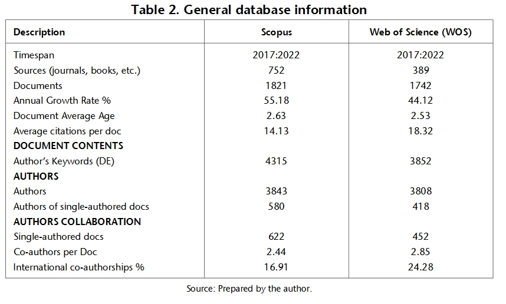
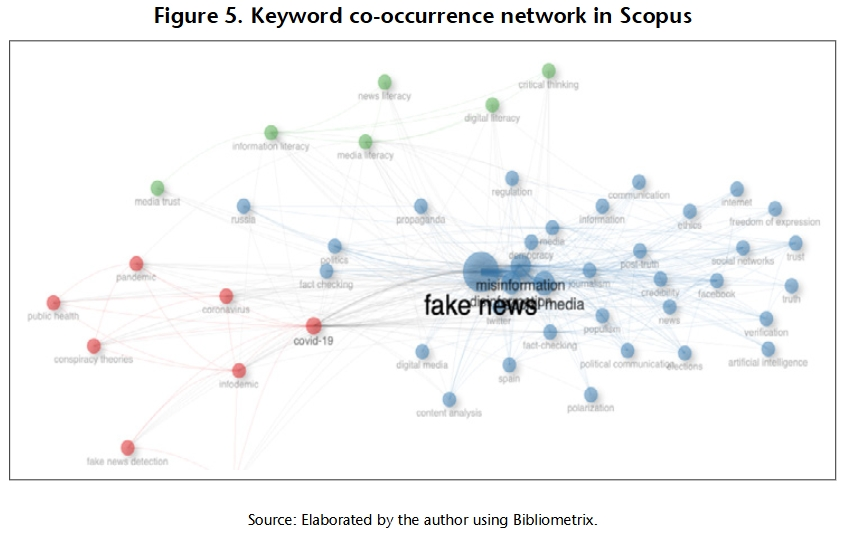
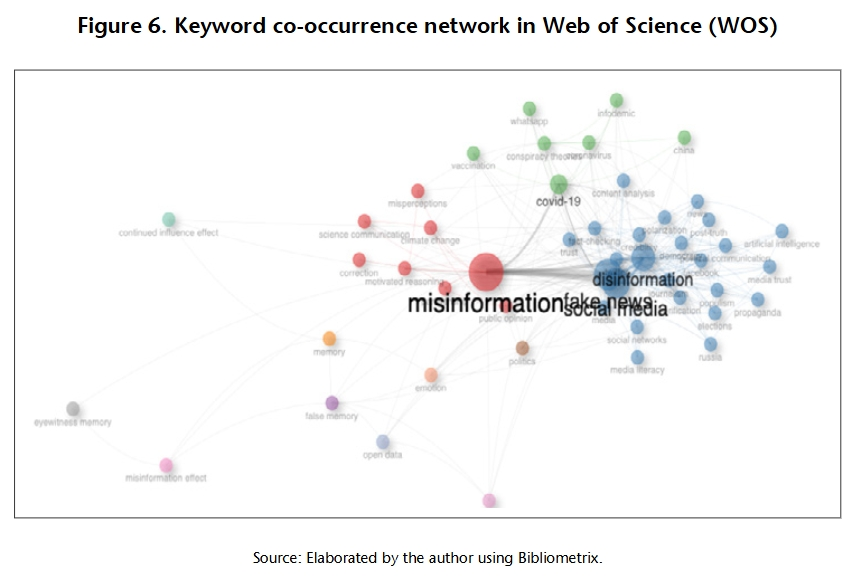
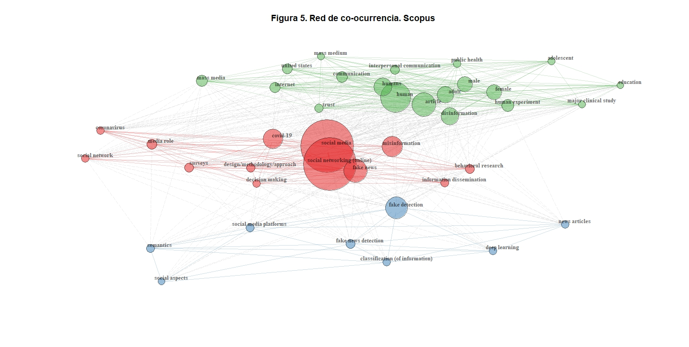
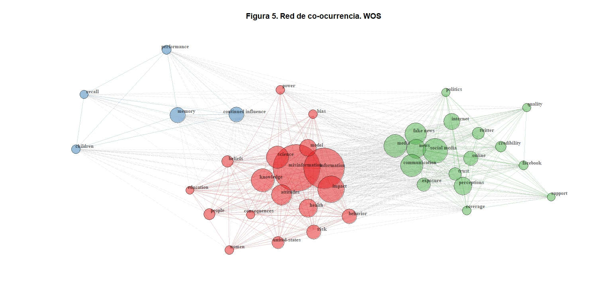

# 1 Artículo seleccionado

Missau, L. D. (2024). *The Role of Social Sciences in the Study of Misinformation: A Bibliometric Analysis of Web of Science and Scopus Publications (2017‑2022)*. **Tripodos, 56**, 141‑166. https://doi.org/10.51698/tripodos.2024.56.01

## Breve resumen del artículo

El artículo de Missau (2024) examina la contribución de las Ciencias Sociales al estudio de la desinformación en sus distintas dimensiones a través de análisis de redes y bibliometría. El autor recupera publicaciones de Web of Science (WOS) y Scopus entre 2017 y 2022 mediante cadenas de búsqueda en inglés y limitan los resultados a: artículos científicos, estado de publicación finalizado, años 2017 a 2022, y dentro del área de Ciencias Sociales.

La base de Scopus se consulta con la cadena `TITLE‑ABS‑KEY (misinformation OR disinformation OR fake AND news)` y filtros por tipo de documento, subárea (SOCI), idioma y años, mientras que en WOS se emplea `ALL=(misinformation OR disinformation OR fake news)` con filtros por tipo de documento y categorías temáticas del "Social Sciences Citation Index". Estas busquedas arrojan 1 821 documentos de Scopus y 1 742 de WOS, y para el procesamiento de estos artículos se utiliza la libreria de R *Bibliometrix*, la cual es utilizada por su diseño enfocado en el análisis bibliométrico, donde el análisis siguió el siguiente proceso:

(a) una comparación general de ambas bases de datos y la combinación de artículos publicados en ambas bases; (b) la descripción de tendencias de investigación; (c) la identificación de autores más productivos y con mayor impacto de acuerdo con el numero de publicaciones e indice-H; (d) la identificación y descripción de las revistas más relevantes; (e) descripción de instituciones y países más productivos; (f) descripción de palabras clave de los autores; y (g) el análisis cualitativo de los artículos más citados. Entre los resultados destacan el crecimiento anual de publicaciones sobre desinformación en ambas bases de datos (55,18 % en Scopus y 44,12 % en WOS), además de la distribución por revistas, donde los 1821 artículos de scopus se encuentran en 752 revistas, mientras que los 1742 artículos de wos se publicaron en 389 revistas, a pesar de esto el número total de autores es similar en las dos bases de datos: 3843 en Scopus y 3808 en WOS. Estas autorías por otra parte se traducen en 580 autores unicos en Scopus mientras que en WOS hay 418, lo que contribuye a una mayor tasa de coautores por documento en WOS (= 2,85) que en Scopus (= 2,44)

## Justificación de la selección del artículo

Este artículo fue elegido porque combina tres aspectos clave para evaluar la reproducibilidad: el uso de bases de datos comerciales (WOS y Scopus), la aplicación de un paquete de análisis de código abierto (Bibliometrix) y el foco en desinformación y ciencias sociales, permitiendo lecturas complejas a través de los datos obtenidos. Aunque el autor menciona las cadenas de búsqueda y utiliza software libre, la replicación exacta de sus hallazgos requiere clarificar los procedimientos y evaluar si los datos y el código son realmente accesibles y están explicitados en el artículo, la revista o el perfil del autor. Este artículo tensiona las dimensiónes entre el acceso abierto y la dependencia de fuentes de datos, un tema central en las discusiones contemporáneas sobre ciencia abierta, principios FAIR para datos de investigación (Wilkinson et al. 2016) y las propias políticas de la revista donde está publicado el artículo, la cual se adscribe a la declaración de Berlin sobre el acceso abierto, donde la revista se compromete a fomentar el deposito de la versión completa del artículo y todo el contenido, así como las herramientas de software en formatos libremente accesibles y compatibles.

# 2 Evaluación de reproducibilidad y transparencia académica

Para determinar el grado de apertura y replicabilidad del estudio de Missau (2024), este reporte utiliza como marco de referencia las *Transparency and Openness Promotion (TOP) Guidelines*. Estas directrices permiten evaluar si la investigación trasciende la mera descripción de resultados para convertirse en un proceso verificable y reproducible. El análisis del estudio arroja una paradoja crítica entre la intención de apertura del autor y las barreras en su ejecución, ya que, a pesar de extraer documentos con cadenas de busqueda explicitadas en el texto, no da acceso a los metadatos exportados impidiendo a otros investigadores verificar las exclusiones manuales o replicar la consulta, contraviniendo el estándar mínimo de transparencia de datos que exige declarar la disponibilidad y ubicación de los datos. Esto genera una barrera inicial puesto que wos y scopus son plataformas de suscripción, y aunque se detallan con precisión las cadenas de búsqueda y los filtros utilizados, el estudio no deposita los resultados brutos: 1,821 registros de Scopus y 1,742 de WOS.

## 2.1 Infraestructura de datos, código y transparencia

Esta omisión contraviene el estándar mínimo de transparencia de datos de las guías TOP, ya que la volatilidad inherente a estos índices (actualizaciones constantes y correcciones de metadatos) impide que una búsqueda realizada hoy arroje resultados idénticos a los de abril de 2023, sin embargo, es posible que los resultados sean simiares, ya que el texto de Missau es de 2024. Adicionalmente, Missau describe una "depuración manual" de registros basada en títulos y resúmenes para excluir trabajos irrelevantes. No obstante, no se explicitan los criterios de exclusión ni se documenta el número de artículos descartados en cada etapa.

Por otra parte, si bien se usó el paquete de R **Bibliometrix**, el cual es un buen camino hacía la reproducibilidad por ser un software libre, la ausencia de los scripts específicos reduce el proceso a una "caja negra". Ya que sin estos insumos, no es posible verificar los parámetros de funciones críticas como `convert2df()` o `biblioAnalysis()`, ni comprender cómo se transformaron los datos brutos en las figuras presentadas a pesar de que **Bibliometrix** contiene diversos tutoriales que podrían facilitar la reproducción de estos resultados.

No obstante, la no accesibilidad de estos elementos (Metadatos exportados de las plataformas y scripts de R), no cumple con la adhesión que hace la revista *Tripodos* a la " La Declaración de Berlín sobre acceso abierto" y a la definición de Acceso Abierto de la UNESCO, donde se explicita que "Las contribuciones del acceso abierto incluyen los resultados de la investigación científica original, datos primarios y metadatos (...)" (Sociedad Max Planck, ed, 2003) y "Hace posible construir bases de datos de conocimiento y reutilizar lo publicado." (UNESCO, 6 de mayo de 2026) respectivamente.

# 3 Análisis reproducible

El análisis reproducible busca replicar uno de los resultados reportados por Missau (2024). Dado que el acceso a los datos originales es restringido y que el código no fue publicado, se optó por reproducir manualmente la **Tabla 2** de la información general de ambas bases de datos (Missau, L. D. 2024, pp. 149), **Figura 5** y **Figura 6** de red de co-ocurrencia de palabras claves en Scopus y Wos respectivamente (Missau, L. D. 2024, pp. 157). Esta elección se sustenta principalmente en el manejo de información del autor de este informe, y en que la tabla 2 efué realizada por el autor mientras que las figuras fueron realizadas con *Bibliometrix*, de esta manera también se pone a prueba la capacidad del autor de utilizar la herramienta y discutir las decisiones metodológicas referentes a porque realizar manualmente algunos apartados de la investigación como la **tabla 2**, y otros utilizando *Bibliometrix*.

## 3.1 Resultado a reproducir

La **Tabla 2** representa la totalidad de información extraida de las bases de datos posterior al procesamiento manual y la exclusión de ciertas publicaciones, esta tabla explicita por ejemplo la cantidad de revistas que contienen las publicaciones de ambas fuentes, el crecimiento anual, una media de citas por publicación, cantidad de palabras clave, publicaciones con solo un autor, y porcentaje de co-autoría, entre otros. Las **Figuras 5 y 6** representan graficamente la co-ocurrencia de palabras clave separadas en ambas plataformas: Scopus (figura 5) y WOS (figura 6), esta representa a su vez una alta concentración de estudios etiquetados en "Fake News" en Scopus, mientras que en WOS la concentración está en "Misinformation".

{#fig-tabla2 width="60%"}

{#fig-5 width="60%"}

{#fig-6 width="60%"}

## 3.2 Proceso de reproducción

Utilizando las cadenas de búsqueda expuestas en el paper, se realizo una busqueda en WOS y Scopus, arrojando 4.474 y 1.961 artículos respectivamente, numeros muy alejados de los 1.821 (wos) y 1.742 (Scopus) reportados por Missau (2024), sin embargo, estos numeros se reducen al procesar la información; eliminar duplicados y dejando un filtro estricto de años (PY \>= 2017 & PY \<= 2022) al crear el dataframe, quedando finalmente en 1961 documentos de Scopus y 4027 de WOS. Con estas fuentes de información y los metadatos exportados en formato ".txt" para WOS y ".bib" para Scopus, segun recomendaciones de la documentación de bibliometrix, se realiza la instalación de la libreria en el ecoistema de "Rstudio". *Bibliometrix*, se instala con el siguiente comando en la consola:

``` r
install.packages("bibliometrix")
```

Esta plataforma también tiene puede operar en un entorno local web que podemos llamar a través de:

``` r
library(bibliometrix)
biblioshiny()
```

Sin embargo, la reproducción de los resultados seleccionados se hizo a través de la interfaz de **R** utilizando un script con los siguientes pasos enlistados:

1.  Carga los documentos de Scopus y WOS por separado si realizar ningun tipo de manipulación

``` r
#Bibliometrix----

##llamar bibliometrix----
library(bibliometrix)

##ingresar a interfaz web----
biblioshiny()

##Carga y procesamiento inicial----

###cargar wos.txt y scopus.bib ----
wos_raw <- convert2df(file = "wos.txt", dbsource = "wos", format = "plaintext")
scopus_raw <- convert2df(file = "scopus.bib", dbsource = "scopus", format = "bibtex")
```

2.  Luego, genera un dataframe dejando de lado cualquier tipo de documento que esté fuera del periodo 2017-2022, y otro que combina ambos dataframe (a pesar de no utilizar este datafre, se suele hacer cómo una buena práctica)

``` r
###Filtrar 2017-2022
wos_df <- subset(wos_raw, PY >= 2017 & PY <= 2022)
scopus_df <- subset(scopus_raw, PY >= 2017 & PY <= 2022)

###Combinar df---- 
merged_data <- mergeDbSources(wos_df, scopus_df, remove.duplicated = TRUE)
```

3.  Una vez creados los dataframe, se ejecuta el comando de análisis y sumario que entregará una mirada general de todas las caracteristicas del dataframe; Información principal (cantidad de journals, documentos, porcentaje de crecimiento, promedio de citas por documentos, etc), y desglosada por autoría, fuentes, tipos, keywords, etc. Categorías que son coincidentes con los principales graficos de la publación de Missau, L. D. (2024). Esta parte del código permite una reproducción parcial de la Tabla 2, puesto que a causa de la falta del script utilizado en el texto y de competencias personales del autor de este informe, la ejecución del script se limita a solo entregar la información en bruto, por lo que se ejecuta de manera separada el análisis para Scopus y Wos, y luego, manualmente se realiza la tabla, algo que a su vez, se condise con el pie de página de la tabla 2 "Source: Prepared by the author".

``` r
##análisis. Tabla 2----

###análisis merged_df----
results <- biblioAnalysis(merged_data)
summary(results)

###Análisis Scopus_df ----
results_scopus <- biblioAnalysis(scopus_df)
summary(results_scopus)

###Análisis WoS_df----
results_wos <- biblioAnalysis(wos_df)
summary(results_wos)
```

4.  Finalmente se replican las figuras 5 y 6, correspondientes a las redes de co-ocurrencia de palabras clave de l_s autor_s a través de las funciones de "network matrix", para luego graficar estas redes de manera separada creando un plot.

``` r
##análisis. Figura 5 y 6----

###Co-ocurrencia scopus.bib----
NetMatrix_scopus <- biblioNetwork(scopus_df, 
                           analysis = "co-occurrences", 
                           network = "keywords", 
                           sep = ";")

###Co-ocurrencia wos.txt----
NetMatrix_wos <- biblioNetwork(wos_df, 
                           analysis = "co-occurrences", 
                           network = "keywords", 
                           sep = ";")

###Graficar red scopus----
net_plot_scopus <- networkPlot(NetMatrix_scopus, 
                        n = 40,             # Número de palabras principales a mostrar
                        Title = "Figura 5. Red de co-ocurrencia de palabras clave de autor_s. Scopus", 
                        type = "fruchterman", # Algoritmo de distribución
                        size = TRUE,# Tamaño de los nodos
                        size.cex = TRUE,
                        remove.multiple = TRUE, 
                        labelsize = 0.8,    # Tamaño de la letra
                        edgesize = 3,       # Grosor de las líneas de conexión
                        alpha = 0.5,
                        weighted = TRUE,
                        cluster = "walktrap") # Para que agrupe por colores


###Graficar red wos----
net_plot_wos <- networkPlot(NetMatrix_wos, 
                        n = 40,             # Número de palabras principales a mostrar
                        Title = "Figura 6. Red de co-ocurrencia de palabras clave de autor_s. Web of Science (WOS)", 
                        type = "fruchterman", # Algoritmo de distribución
                        size = TRUE,# Tamaño de los nodos
                        size.cex = TRUE,
                        remove.multiple = TRUE, 
                        labelsize = 0.8,    # Tamaño de la letra
                        edgesize = 3,       # Grosor de las líneas de conexión
                        alpha = 0.5,
                        weighted = TRUE,
                        cluster = "walktrap") # Para que agrupe por colores (clusters)
```

# 4 Resultados de reproductibilidad

A causa de una limitación de conocimientos y falta de transparencia del texto analizado, la tabla 2 se presenta en formato *MarkDown* para visualizar los datos.

**Tabla 2 (Reproducción). Información General de la Base de Datos**

| Description                     |  Scopus   | Web of Science (WOS) |
|:--------------------------------|:---------:|:--------------------:|
| Timespan                        | 2017:2022 |      2017:2022       |
| Sources (journals, books, etc.) |    818    |         1207         |
| Documents                       |   1961    |         4027         |
| Annual Growth Rate %            |   59.74   |        42.23         |
| Document Average Age            |   5.56    |         5.53         |
| Average citations per doc       |   39.26   |        43.93         |
| **DOCUMENT CONTENTS**           |           |                      |
| Author's Keywords (DE)          |   4536    |         8253         |
| **AUTHORS**                     |           |                      |
| Authors                         |   4081    |        11657         |
| Authors of single-authored docs |    627    |         706          |
| **AUTHORS COLLABORATION**       |           |                      |
| Single-authored docs            |    675    |         760          |
| Co-authors per Doc              |   2.43    |         3.65         |
| International co-authorships %  |   17.95   |        27.07         |

La figura 5 y 6, se presentan acontinución:

## Figura 5. Red de co-ocurrencia de palabras clave de autor_s. Scopus

```{r}
library(bibliometrix)

# Cargar datos
scopus_raw <- convert2df(file = "scopus.bib", dbsource = "scopus", format = "bibtex")
scopus_df <- subset(scopus_raw, PY >= 2017 & PY <= 2022)

# Red de co-ocurrencia
NetMatrix_scopus <- biblioNetwork(scopus_df, 
                                   analysis = "co-occurrences", 
                                   network = "keywords", 
                                   sep = ";")

# Graficar
net_plot_scopus <- networkPlot(NetMatrix_scopus, 
                        n = 40,
                        Title = "Figura 5. Red de co-ocurrencia. Scopus", 
                        type = "fruchterman",
                        size = TRUE,
                        size.cex = TRUE,
                        remove.multiple = TRUE, 
                        labelsize = 0.8,
                        edgesize = 3,
                        alpha = 0.5,
                        weighted = TRUE,
                        cluster = "walktrap")
```

{#fig-5-rep width="60%"}

## Figura 6. Red de co-ocurrencia de palabras clave de autor_s. Web of Science (WOS)

```{r}
library(bibliometrix)

# Cargar datos
wos_raw <- convert2df(file = "wos.txt", dbsource = "wos", format = "plaintext")
wos_df <- subset(wos_raw, PY >= 2017 & PY <= 2022)

# Red de co-ocurrencia
NetMatrix_wos <- biblioNetwork(wos_df, 
                                   analysis = "co-occurrences", 
                                   network = "keywords", 
                                   sep = ";")

# Graficar
net_plot_wos <- networkPlot(NetMatrix_wos, 
                        n = 40,
                        Title = "Figura 6. Red de co-ocurrencia. WOS", 
                        type = "fruchterman",
                        size = TRUE,
                        size.cex = TRUE,
                        remove.multiple = TRUE, 
                        labelsize = 0.8,
                        edgesize = 3,
                        alpha = 0.5,
                        weighted = TRUE,
                        cluster = "walktrap")
```

{#fig-6-rep width="60%"}

# 4 Conclusiones

El estudio de Missau (2024) ofrece una descripción valiosa de la producción científica sobre desinformación en Ciencias Sociales utilizando técnicas bibliométricas, no obstante, desde la perspectiva de la reproducibilidad, se identifica un nivel de apertura deficiente. Si bien se especifican las cadenas de búsqueda y se emplea un paquete de código abierto, la ausencia de un depósito de datos y del código de análisis limita la capacidad de otros investigadores para verificar o extender el trabajo. Además, la depuración manual de registros deja una "caja negra" metodológica que dificulta replicar las decisiones tomadas durante la limpieza de datos, principalmente cuando el autor se refiere a "criterios de exclusión", los cuales no explicita en el texto. Las guías *TOP* sugieren que los artículos deberían, como mínimo, indicar la disponibilidad de datos y código y depositarlos en repositorios confiables, criterio que no se cumple de ninguna manera. Cumplir con estos estándares no solo facilitaría la reproducción, sino que también aumentaría la confianza en los resultados, especialmente en un contexto donde la volatilidad de las bases de datos puede alterar los análisis a lo largo del tiempo. Por otra parte, es destacable en la discusión que una revista de acceso abierto indexada y que cuenta con indicadores destacables; cuartil 2 en scopus, reconocimientos de calidad y de indexación (por parte de WOS), no verifique ni audite sus publicaciones para corroborar que estas también se adhieran a estandares de calidad y buenas prácticas de ciencia abierta, las cuales, según declaran, forman parte de su linea editorial. De esta manera la conversación sobre el acceso abierto y las practicas editoriales de las revistas nos impulsa a preguntar si esta adhesión se reduce a determinar el tipo de acceso y no así, las políticas de gestión de información y reproductibilidad del conocimiento científico para impulsar nueva investigación; Localizable, Accesible, Interoperable y Reutilizable.

# 5 Recomendaciones

1.  **Transparencia y deposito de datos:** Explicitar los criterios de exclusión, la ruta de acceso de la información. Esto, junto con publicar los conjuntos de datos extraídos de Scopus y WOS en un repositorio abierto (por ejemplo, Zenodo) junto con un identificador DOI, para impulsar la reutilización de datos y permitir el escrutinio científico que permita extender los margenes de la investigación. Esto a su vez se vincula con permitir el acceso y reutilización del sript utilizado, considerando además que es ejecutado en una libreria de código abierto. El código puede alojarse en plataformas como GitHub y vincularse al artículo. Esto se alinea con el estándar de nivel 2 de las guías TOP, que exige que el código esté disponible y que el enlace funcione.
2.  **Uso de fuentes de datos abiertas:** Considerar el uso de bases de datos bibliográficas de acceso abierto como **OpenAlex** o **Dimensions** (ambas compatibles con Bibliometrix) para garantizar que el proceso pueda replicarse sin barreras económicas. Esto no es incompatible con utilizar fuentes de pago, pero extiende la posibilidad de investigadores para replicar el estudio en muestras de acceso abierto.
3.  **Fechas:** Dado que las bases de datos se actualizan continuamente, registrar las fechas de descarga.

# 6 Referencias

Aria, M., & Cuccurullo, C. (2017). **Bibliometrix: An R-tool for comprehensive science mapping analysis**. *Journal of Informetrics*, 11(4), 959–975. https://doi.org/10.1016/j.joi.2017.08.007

Missau, L. D. (2024). **The role of Social Sciences in the study of misinformation: A bibliometric analysis of Web of Science and Scopus publications (2017–2022)**. *Tripodos*, (56), 141–166. https://doi.org/10.51698/tripodos.2024.56.01

Nosek, B. A., Alter, G., Banks, G. C. et al. (2015). **Promoting an open research culture**. *Science*, 348(6242), 1422–1425. https://doi.org/10.1126/science.aab2374

Sociedad Max Planck. (2003). **La Declaración de Berlín sobre acceso abierto**. *GeoTrópico*, 1(2), 152–154. http://www.geotropico.org/1_2_Documentos_Berlin.htm

UNESCO. (2021). **Recomendación de la UNESCO sobre la Ciencia Abierta (SC-PCB-SPP/2021/OS/UROS)**. https://doi.org/10.54677/YDOG4702

Wilkinson, M. D., Dumontier, M., Aalbersberg. et al. (2016). **The FAIR Guiding Principles for scientific data management and stewardship**. *Scientific Data*, 3, Artículo 160018. https://doi.org/10.1038/sdata.2016.18
